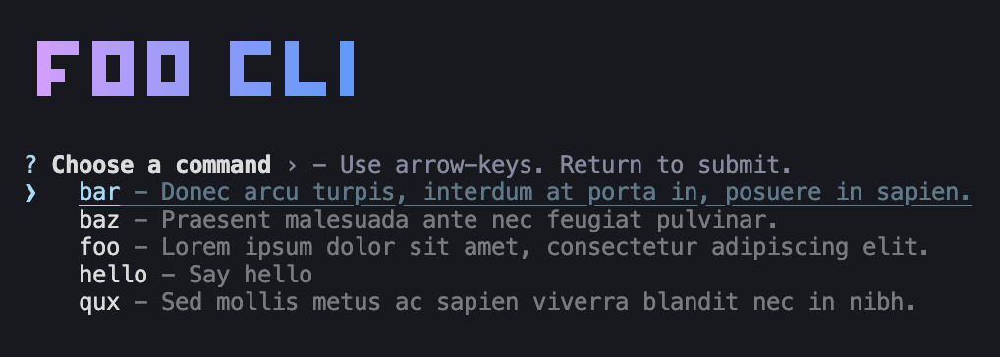
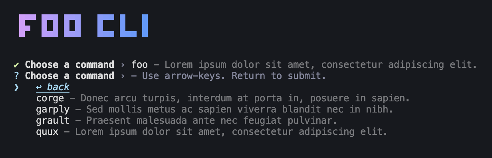

# Gud CLI Command Menu Plugin# Gud CLI

[](https://github.com/ryangoree/gud-cli/tree/main/packages/cli-menu)
[](https://npmjs.com/package/@gud/cli-menu)
[](./LICENSE)

A [Gud CLI](https://github.com/ryangoree/gud-cli/tree/main) plugin that
prompts the user to select a subcommand when required.

```sh
npm install @gud/cli-menu
```

```ts
import { run } from '@gud/cli';
import { menu } from '@gud/cli-menu';

run({
  plugins: [
    menu({
      title: 'Foo CLI',
      titleColors: ['#D89DFF', '#519BFF'],
    })
  ],
});
```



After the user selects a subcommand, the command will be resolved and if it also
requires a subcommand, the user will be prompted again, but this time can also
select `↩ back` to go back to the previous menu. This will continue until the
user has selected all required subcommands.


